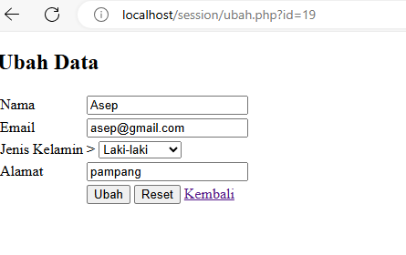
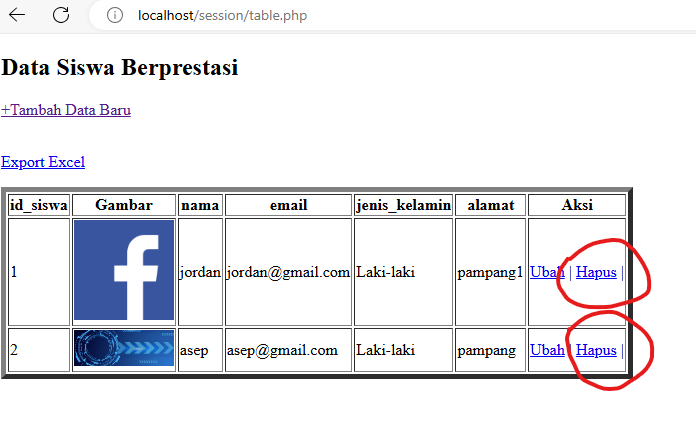
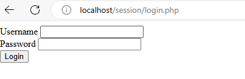
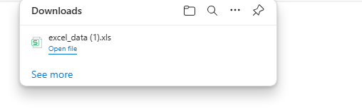

# koneksi database 
## Program
```php
<?php

  

//koneksi ke database

$koneksi = mysqli_connect('localhost', 'root', '', 'siswa');

if ($koneksi) {

    echo "<br> koneksi aman <br>";

} else {

    echo "error, tidak bisa koneksi ke database";

}

//jalankan query seleksi

$select = mysqli_query($koneksi, "SELECT * FROM  siswa");
```
## Hasil
![koneksi][Aset/Koneksi.png]
## Analisis
- **Koneksi ke Database**:
    
    - Program menggunakan fungsi `mysqli_connect()` untuk melakukan koneksi ke database MySQL.
    - Parameter pertama adalah nama host (`localhost`), yang menunjukkan bahwa database berjalan pada server lokal.
    - Parameter kedua adalah nama pengguna (`root`), yang merupakan pengguna bawaan MySQL pada banyak instalasi.
    - Parameter ketiga adalah kata sandi kosong (`''`), menunjukkan bahwa tidak ada kata sandi yang diperlukan.
    - Parameter keempat adalah nama database (`siswa`), yang menunjukkan bahwa program akan terhubung ke database bernama "siswa".
    - Jika koneksi berhasil, program akan menampilkan pesan "koneksi aman". Jika tidak, pesan "error, tidak bisa koneksi ke database" akan ditampilkan.
- **Eksekusi Query Seleksi**:
    
    - Setelah koneksi berhasil, program menjalankan query SQL untuk melakukan seleksi data dari tabel `siswa`.
    - Query tersebut dieksekusi menggunakan fungsi `mysqli_query()`.
    - Hasil dari eksekusi query akan disimpan dalam variabel `$select`.
- **Pesan Responsif**:
    
    - Program memberikan respons tergantung pada hasil koneksi ke database. Jika koneksi berhasil, pesan "koneksi aman" akan ditampilkan, jika tidak, pesan "error, tidak bisa koneksi ke database" akan ditampilkan.
- **Manajemen Error**:
    
    - Program tidak melakukan manajemen error yang lebih lanjut, seperti menangkap pesan kesalahan yang mungkin terjadi selama koneksi ke database.
    - Selain itu, tidak ada penanganan khusus yang dilakukan jika query seleksi gagal.
- **Potensi Peningkatan**:
    
    - Program dapat meningkatkan manajemen error dengan menambahkan penanganan untuk situasi di mana koneksi ke database gagal atau jika query seleksi tidak berhasil dieksekusi.
    - Menggunakan `mysqli_connect_error()` untuk menampilkan pesan kesalahan yang lebih deskriptif jika koneksi gagal.
## Kesimpulan
1. **Koneksi ke Database**:
    
    - Program menggunakan fungsi `mysqli_connect()` untuk melakukan koneksi ke database MySQL.
    - Jika koneksi berhasil, pesan "koneksi aman" akan ditampilkan. Jika tidak, pesan "error, tidak bisa koneksi ke database" akan ditampilkan.
    - Parameter fungsi `mysqli_connect()` mencakup nama host, nama pengguna, kata sandi, dan nama database yang akan diakses.
2. **Eksekusi Query Seleksi**:
    
    - Setelah koneksi berhasil, program menjalankan query SQL untuk melakukan seleksi data dari tabel `siswa`.
    - Query tersebut dieksekusi menggunakan fungsi `mysqli_query()` dengan hasil query disimpan dalam variabel `$select`.
3. **Responsif Terhadap Koneksi**:
    
    - Program memberikan respons yang sesuai tergantung pada hasil koneksi ke database. Ini memberikan informasi kepada pengguna apakah koneksi berhasil atau gagal.
4. **Manajemen Error**:
    
    - Program belum melakukan manajemen error yang cermat. Ini bisa menjadi titik perbaikan untuk memastikan bahwa pesan kesalahan yang tepat ditampilkan jika ada masalah dengan koneksi atau eksekusi query.
5. **Potensi Peningkatan**:
    
    - Penanganan error yang lebih baik dapat ditambahkan untuk mengatasi situasi ketika koneksi ke database gagal atau query seleksi tidak berhasil.
    - Pesan kesalahan yang lebih deskriptif dapat disediakan untuk membantu dalam pemecahan masalah jika terjadi masalah dengan koneksi atau eksekusi query.

Program ini merupakan langkah awal yang baik untuk mengakses data dari database menggunakan PHP, namun, perlu ditingkatkan dengan manajemen error yang lebih baik untuk meningkatkan keandalan dan keamanan program.
# tampilkan data
## Program
```php
<!DOCTYPE html>

<html lang="en">

  

<head>

    <meta charset="UTF-8">

    <meta name="viewport" content="width=device-width, initial-scale=1.0">

    <title>index tabel</title>

</head>

  

<body>

  

    <h2>Data Siswa Berprestasi</h2>

    <a href="tambah.php">+Tambah Data Baru</a><br><br>

    <p>

        <a href="export.php">Export Excel</a>

    </p>

    <table border="5">

        <tr>

            <th>id_siswa</th>

            <th>Gambar</th>

            <th>nama</th>

            <th>email</th>

            <th>jenis_kelamin</th>

            <th>alamat</th>

            <th>Aksi</th>

        </tr>

  

        <?php

        include "koneksi.php";

        $i = 1;

        $query = mysqli_query($koneksi, "SELECT * FROM siswa");

        while ($data = mysqli_fetch_array($query)) {

            ?>

  

            <tr>

  

                <td><?php echo $i; ?></td>

                <td>

                     " width="100">

                </td>

                <td><?php echo $data['nama']; ?></td>

                <td><?php echo $data['email']; ?></td>

                <td><?php echo $data['jenis_kelamin']; ?></td>

                <td><?php echo $data['alamat']; ?></td>

  

                <td>

                    <a href="ubah.php?id=<?= $data['id_siswa']; ?>">Ubah</a> |

                    <a href="hapus.php?id=<?= $data['id_siswa']; ?>">Hapus</a> |

                </td>

            </tr>

            <?php

            $i++;

        }

        ?>

    </table>

</body>

  

</html
```
## Hasil
![tampilkandata][Aset/tampilkan.png]
## Analisis
- **Deklarasi DOCTYPE dan HTML Tag**: Dokumen dimulai dengan deklarasi DOCTYPE `<!DOCTYPE html>` yang menandakan bahwa ini adalah dokumen HTML5. Kemudian, terdapat tag `<html lang="en">` yang menandakan awal dari dokumen HTML dengan pengaturan bahasa Inggris.
    
- **Head Section**: Bagian ini memiliki beberapa meta tag, termasuk meta charset dan viewport untuk pengaturan tampilan pada perangkat berbasis web. Ada juga tag `<title>` yang memberikan judul halaman.
    
- **Body Section**: Bagian ini merupakan isi dari halaman web. Terdapat judul "Data Siswa Berprestasi" yang ditampilkan sebagai heading level 2 (`<h2>`). Di bawahnya, terdapat tautan "Tambah Data Baru" yang mengarahkan ke halaman `tambah.php` untuk menambahkan data baru. Ada juga tautan "Export Excel" yang mengarahkan ke halaman `export.php` untuk mengekspor data dalam format Excel.
    
- **Tabel Data Siswa**: Terdapat sebuah tabel HTML dengan border set ke 5. Tabel ini menampilkan data siswa yang diambil dari database. Setiap baris tabel menampilkan informasi siswa seperti ID, gambar, nama, email, jenis kelamin, alamat, dan aksi yang bisa dilakukan terhadap data tersebut.
    
- **PHP Script**: Di dalam tag PHP (`<?php ... ?>`), terdapat skrip PHP yang melakukan beberapa hal:
    
    - Menghubungkan ke database dengan menggunakan `include "koneksi.php";`.
    - Melakukan query ke database untuk mengambil data siswa dari tabel `siswa`.
    - Menggunakan loop `while` untuk menampilkan setiap baris data siswa sebagai baris tabel HTML.
    - Setiap baris tabel menampilkan informasi siswa seperti nomor ID (berurutan), gambar, nama, email, jenis kelamin, alamat, dan tautan untuk mengubah atau menghapus data.
- **Gambar Siswa**: Terdapat tag `` di dalam kolom "Gambar" yang menampilkan gambar siswa. Nama gambar diambil dari database dan digabungkan dengan alamat direktori `img/`.
## Kesimpulan
- **Fungsionalitas Utama**:
    
    - Menampilkan data siswa berprestasi dari database dalam tabel.
    - Setiap baris tabel menampilkan informasi tentang siswa, termasuk ID siswa, gambar, nama, email, jenis kelamin, alamat, dan tautan untuk mengubah atau menghapus data.
- **Interaksi Pengguna**:
    
    - Pengguna dapat menambahkan data siswa baru dengan mengklik tautan "+Tambah Data Baru", yang akan mengarahkan mereka ke halaman `tambah.php`.
    - Pengguna dapat mengubah data siswa dengan mengklik tautan "Ubah" di setiap baris tabel, yang akan mengarahkan mereka ke halaman `ubah.php` dengan ID siswa yang sesuai.
    - Pengguna dapat menghapus data siswa dengan mengklik tautan "Hapus" di setiap baris tabel, yang akan menghapus data siswa dari database.
- **Fitur Tambahan**:
    
    - Terdapat tautan "Export Excel" yang mengarahkan pengguna ke halaman `export.php` untuk mengekspor data dalam format Excel.
    - Setiap siswa memiliki gambar yang ditampilkan di dalam tabel. Gambar tersebut diambil dari direktori `img/` dengan nama gambar yang tersimpan dalam database.
- **Penggunaan PHP dan MySQL**:
    
    - Program menggunakan PHP untuk mengambil data siswa dari database menggunakan query SQL.
    - Setiap baris data ditampilkan dengan menggunakan loop `while` dalam PHP.
    - Program juga menggunakan PHP untuk menghubungkan ke database dan menyertakan file koneksi dengan perintah `include`.
- **Responsivitas**:
    
    - Tampilan halaman dapat disesuaikan dengan perangkat pengguna karena penggunaan meta viewport untuk mengatur tampilan responsif.
# tambahkan data
## Program
```php
<!DOCTYPE html>

<html lang="en">

  

<head>

    <title>Document</title>

</head>

  

<body>

    <h2>Tambah Data</h2>

    <?php

  

    include "koneksi.php";

  

    function upload(): string

    {

        $nameImage = $_FILES['gambar']['name'];

        $directoryFile = $_FILES['gambar']['tmp_name'];

        $errorImage = intval($_FILES['gambar']['error']);

        $sizeFile = $_FILES['gambar']['size'];

  

        // cek apakah gambar ada

        if ($errorImage === 4) {

            echo "<script>alert('Anda Belum Upload Gambar')</script>";

            return false;

        }

  

        // mengambil ekstensi file

        $validType = ['svg', 'jpg', 'png', 'jpeg', 'webp'];

        $extensionFile = explode(".", $nameImage);

        $extensionValid = strtolower(end($extensionFile));

  

        // cek apakah yang diupload gambar atau bukan

        if (!in_array($extensionValid, $validType)) {

            echo "<script>alert('yang anda Upload bukan gambar')</script>";

            return false;

        }

  

        // cek size file

        if ($sizeFile > 3_000_000) {

            echo "<script>alert('Ukuran File Terlalu Besar!!(Maks 3MB)')</script>";

            return false;

        }

  

        // upload file

        $nameImage = uniqid() . "." . $extensionValid;

        move_uploaded_file($directoryFile, "img/{$nameImage}");

  

        // mengembalikan namafile yg sudah divalidasi

        return $nameImage;

    }

  
  

    if (isset($_POST['simpan'])) {

        $nama = $_POST['nama'];

        $email = $_POST['email'];

        $jenis_kelamin = $_POST['jenis_kelamin'];

        $alamat = $_POST['alamat'];

  

        $gambar = upload();

        if (!$gambar) {

            return false;

        }

  

        // * true / false

        $query = mysqli_query($koneksi, "INSERT into siswa(nama,email,jenis_kelamin,alamat,gambar)

  

        values ('$nama','$email','$jenis_kelamin','$alamat', '$gambar')");

  

        if ($query == true) {

            echo "<script>

            alert('Tambah data Berhasil')

            window.location.href='table.php'

            </script>";

        } else {

            echo '<script>alert("Tambah data gagal")</script>';

        }

    }

  
  

    ?>

    <form method="post" enctype="multipart/form-data">

        <table>

            <tr>

                <td>Nama</td>

                <td><input type="text" name="nama"></td>

            </tr>

            <tr>

                <td>Email</td>

                <td><input type="text" name="email"></td>

            </tr>

            <tr>

                <td>Jenis Kelamin</td>

                <td>>

                    <select name="jenis_kelamin">

                        <option>Laki-laki</option>

                        <option>Perempuan</option>

                    </select>

                </td>

            </tr>

  

            <tr>

                <td>Alamat</td>

                <td><input type="text" name="alamat"></td>

            </tr>

  

            <tr>

                <td>Gambar</td>

                <td><input type="file" name="gambar"></td>

            </tr>

  

            <tr>

                <td></td>

                <td>

                    <button name="simpan" type="submit">Simpan</button>

                    <button type="reset">Reset</button>

                    <a href="table.php">Kembali</a>

                </td>

            </tr>

        </table>

    </form>

  

</body>

  

</html>
```
## Hasil
![tambah][Aset/tambahdata.png]
## Analisis
- **Deklarasi DOCTYPE dan HTML Tag**: Deklarasi DOCTYPE `<!DOCTYPE html>` menunjukkan bahwa dokumen ini adalah dokumen HTML5. Kemudian, tag `<html lang="en">` menandakan awal dari dokumen HTML dengan pengaturan bahasa Inggris.
    
- **Head Section**: Bagian ini tidak memiliki konten khusus, hanya terdapat judul halaman web yang dituliskan di tag `<title>Document</title>`.
    
- **Body Section**: Bagian ini merupakan isi dari halaman web. Dalam hal ini, terdapat sebuah form untuk menambahkan data siswa ke dalam database.
    
- **PHP Script**: Terdapat skrip PHP yang dimulai dengan `<?php` dan berakhir dengan `?>`. Ini adalah bagian yang menangani proses pengiriman data form dan penyimpanan ke database. Skrip ini melakukan beberapa hal:
    
    - Memeriksa apakah form telah disubmit dengan menggunakan `isset($_POST['simpan'])`.
    - Jika form telah disubmit, mengambil nilai dari form (nama, email, jenis kelamin, alamat, dan gambar).
    - Menggunakan fungsi `upload()` untuk mengunggah gambar. Jika gambar tidak berhasil diunggah, fungsi ini mengembalikan `false`.
    - Memasukkan data siswa ke dalam database dengan menggunakan query MySQL `INSERT INTO`.
    - Mengarahkan pengguna ke halaman `table.php` jika penambahan data berhasil, dan menampilkan pesan kesalahan jika gagal.
- **Form**: Terdapat sebuah form HTML yang menggunakan metode POST dan memiliki atribut `enctype="multipart/form-data"`, yang diperlukan saat mengunggah file (gambar). Form ini memiliki beberapa input field untuk nama, email, jenis kelamin, alamat, dan gambar. Selain itu, terdapat tombol "Simpan" untuk mengirim data, tombol "Reset" untuk mereset form, dan tautan "Kembali" untuk kembali ke halaman tabel.
## Kesimpulan
program ini adalah sebuah halaman web yang memungkinkan pengguna untuk menambahkan data siswa ke dalam database melalui sebuah formulir. Prosesnya melibatkan penggunaan HTML untuk membuat tampilan form, PHP untuk pemrosesan data form, dan MySQL untuk menyimpan data ke dalam database.

Program ini memiliki beberapa fitur penting, termasuk:

1. Penggunaan PHP untuk memvalidasi dan memproses data form sebelum disimpan ke database.
2. Kemampuan untuk mengunggah gambar melalui form.
3. Penggunaan MySQL untuk menyimpan data siswa yang ditambahkan.
4. Tampilan yang responsif dengan tombol-tombol untuk mengirim data, mereset form, dan kembali ke halaman sebelumnya.
# ubah data 
## Program
```php
<!DOCTYPE html>

<html lang="en">

  

<head>

    <title>Document</title>

</head>

  

<body>

    <h2>Ubah Data</h2>

    <?php

    include "koneksi.php";

  

    $id = $_GET['id'];

  

    if (isset($_POST['simpan'])) {

        $nama = $_POST['nama'];

        $email = $_POST['email'];

        $jenis_kelamin = $_POST['jenis_kelamin'];

        $alamat = $_POST['alamat'];

  

        $query = mysqli_query($koneksi, "UPDATE siswa SET

                                        nama='$nama',

                                        email='$email',

                                        jenis_kelamin='$jenis_kelamin',

                                        alamat='$alamat'

                                        WHERE id_siswa=$id");

        if ($query) {

            echo "<script>

            alert('ubah data Berhasil')

            window.location.href='table.php'

            </script>";

        } else {

            echo '<script>alert("ubah data gagal")</script>';

        }

    }

  

    $query = mysqli_query($koneksi, "SELECT * FROM siswa where id_siswa=$id");

    $data = mysqli_fetch_array($query);

    if ($data == "") {

        die('Data tidak ada');

    }

    ?>

  

    <form method="post">

        <table>

            <tr>

                <td>Nama</td>

                <td><input type="text" value="<?= $data['nama'] ?>" name="nama"></td>

            </tr>

            <tr>

                <td>Email</td>

                <td><input type="text" value="<?= $data['email'] ?>" name="email"></td>

            </tr>

            <tr>

                <td>Jenis Kelamin</td>

                <td>>

                    <select name="jenis_kelamin">

                        <option <?php if ($data['jenis_kelamin'] == "laki-laki")

                            echo 'selected'; ?>>Laki-laki</option>

                        <option <?php if ($data['jenis_kelamin'] == "perempuan")

                            echo 'selected'; ?>>Perempuan</option>

                    </select>

                </td>

            </tr>

  

            <tr>

                <td>Alamat</td>

                <td><input type="text" value="<?= $data['alamat'] ?>" name="alamat"></td>

            </tr>

  

            <tr>

                <td></td>

                <td>

                    <button name="simpan" type="submit">Ubah</button>

                    <button type="reset">Reset</button>

                    <a href="table.php">Kembali</a>

                </td>

            </tr>

        </table>

    </form>

  

</body>

  

</html>
```
## Hasil

## Analisis
- **Deklarasi DOCTYPE dan HTML Tag**: Dokumen ini dimulai dengan deklarasi DOCTYPE `<!DOCTYPE html>` yang menandakan bahwa dokumen ini adalah dokumen HTML5. Kemudian, tag `<html lang="en">` menunjukkan awal dari dokumen HTML dengan pengaturan bahasa Inggris.
    
- **Head Section**: Bagian ini tidak memiliki konten khusus, hanya terdapat judul halaman web yang dituliskan di dalam tag `<title>Document</title>`.
    
- **Body Section**: Bagian ini merupakan isi dari halaman web. Terdapat sebuah form untuk mengubah data siswa dalam database.
    
- **PHP Script**: Terdapat skrip PHP yang dimulai dengan `<?php` dan berakhir dengan `?>`. Ini adalah bagian yang menangani proses pengubahan data siswa dan koneksi ke database. Skrip ini melakukan beberapa hal:
    
    - Mengambil nilai ID siswa dari parameter GET `$_GET['id']`.
    - Jika form telah disubmit, mengambil nilai yang diubah dari form (nama, email, jenis kelamin, alamat) dan mengeksekusi query SQL untuk memperbarui data siswa yang sesuai.
    - Jika proses pengubahan berhasil, menampilkan pesan sukses dan mengarahkan pengguna kembali ke halaman tabel (`table.php`).
    - Jika terjadi kesalahan, menampilkan pesan gagal.
- **Query Database**: Dua query database dieksekusi di dalam script PHP. Pertama, query untuk mengambil data siswa yang akan diubah berdasarkan ID yang diterima dari parameter GET. Kedua, query untuk mengubah data siswa jika form telah disubmit.
    
- **Form**: Terdapat sebuah form HTML yang menggunakan metode POST untuk mengirimkan data. Form ini memiliki input field untuk nama, email, jenis kelamin, dan alamat siswa yang sudah diisi dengan nilai yang ada di database. Tombol "Ubah" digunakan untuk mengirimkan form, tombol "Reset" untuk mereset form, dan tautan "Kembali" untuk kembali ke halaman tabel.
## Kesimpulan
- **Deklarasi DOCTYPE dan HTML Tag**: Program ini dimulai dengan deklarasi DOCTYPE `<!DOCTYPE html>` yang menandakan bahwa dokumen ini adalah dokumen HTML5. Kemudian, terdapat tag `<html lang="en">` yang menandakan awal dari dokumen HTML dengan pengaturan bahasa Inggris.
    
- **Head Section**: Bagian ini tidak memiliki konten khusus, hanya terdapat judul halaman web yang dituliskan di dalam tag `<title>Document</title>`.
    
- **Body Section**: Bagian ini merupakan isi dari halaman web. Terdapat sebuah form untuk mengubah data siswa dalam database.
    
- **PHP Script**: Terdapat skrip PHP yang dimulai dengan `<?php` dan berakhir dengan `?>`. Skrip ini melakukan beberapa hal:
    
    - Menghubungkan ke database dengan menggunakan `include "koneksi.php";`.
    - Mengambil ID siswa yang akan diubah dari parameter GET dengan `$_GET['id']`.
    - Jika form telah disubmit, mengambil nilai yang diubah dari form (nama, email, jenis kelamin, alamat) dan mengeksekusi query SQL untuk memperbarui data siswa yang sesuai.
    - Jika proses pengubahan berhasil, menampilkan pesan sukses menggunakan `alert` JavaScript dan mengarahkan pengguna kembali ke halaman tabel (`table.php`). Jika gagal, menampilkan pesan gagal dengan `alert` JavaScript juga.
    - Memeriksa apakah data siswa dengan ID yang diberikan ada di database. Jika tidak ada, program akan menampilkan pesan "Data tidak ada" dan menghentikan eksekusi dengan `die()`.
- **Query Database**: Dua query database dieksekusi di dalam script PHP. Pertama, query untuk mengambil data siswa yang akan diubah berdasarkan ID yang diterima dari parameter GET. Kedua, query untuk mengubah data siswa jika form telah disubmit.
    
- **Form**: Terdapat sebuah form HTML yang menggunakan metode POST untuk mengirimkan data. Form ini memiliki input field untuk nama, email, jenis kelamin, dan alamat siswa yang sudah diisi dengan nilai yang ada di database. Tombol "Ubah" digunakan untuk mengirimkan form, tombol "Reset" untuk mereset form, dan tautan "Kembali" untuk kembali ke halaman tabel.
# hapus data 
## Program
```php
<?php

  

include('koneksi.php');

  

if(isset($_GET['id'])){

  
  

    $id = $_GET['id'];

  

    $query = mysqli_query($koneksi, "DELETE FROM siswa WHERE id_siswa = $id");

  

   if($query) {

            echo "<script>

            alert('Hapus data Berhasil')

            window.location.href='table.php'

            </script>";

        }else {

            echo '<script>alert("Hapus data gagal")</script>';

        }

}

  

?>
```
## Hasil

## Analisis
- **Koneksi ke Database**: Program ini memasukkan file `koneksi.php` yang berisi konfigurasi koneksi ke database. Ini dilakukan dengan pernyataan `include('koneksi.php');`.
    
- **Pengecekan Parameter GET**: Program menggunakan fungsi `isset($_GET['id'])` untuk memeriksa apakah parameter `id` telah diberikan dalam URL. Jika parameter tersebut tidak ada, maka operasi penghapusan tidak akan dieksekusi.
    
- **Pengambilan ID**: Jika parameter `id` telah diberikan, nilai ID tersebut disimpan dalam variabel `$id`.
    
- **Eksekusi Query DELETE**: Program menjalankan query SQL untuk menghapus data siswa dari tabel `siswa` yang memiliki ID yang sesuai dengan nilai yang diterima melalui parameter GET. Query tersebut dieksekusi menggunakan fungsi `mysqli_query()`.
    
- **Penanganan Hasil Query**: Program mengecek apakah query penghapusan berhasil atau gagal dengan menggunakan struktur kondisional `if-else`. Jika query berhasil dieksekusi, maka akan ditampilkan pesan sukses dengan menggunakan `alert` JavaScript dan mengarahkan pengguna kembali ke halaman tabel (`table.php`). Jika query gagal, akan ditampilkan pesan gagal.
    
- **Pesan Responsif**: Pesan berhasil atau gagal ditampilkan menggunakan `alert` JavaScript, yang memberikan respons visual kepada pengguna tentang hasil operasi penghapusan.
## Kesimpulan
1. **Fungsi Utama**:
    
    - Program ini bertujuan untuk melakukan operasi penghapusan data siswa dari database.
    - Menggunakan parameter ID yang diberikan melalui URL untuk menentukan data siswa yang akan dihapus.
2. **Koneksi ke Database**:
    
    - Memasukkan file `koneksi.php` yang berisi konfigurasi koneksi ke database.
    - Ini memastikan bahwa operasi penghapusan dilakukan pada database yang sesuai.
3. **Pengecekan Parameter GET**:
    
    - Memeriksa apakah parameter `id` telah diberikan dalam URL menggunakan fungsi `isset($_GET['id'])`.
    - Jika parameter tidak diberikan, operasi penghapusan tidak akan dieksekusi.
4. **Pengambilan ID**:
    
    - Jika parameter `id` diberikan, nilai ID disimpan dalam variabel `$id`.
5. **Eksekusi Query DELETE**:
    
    - Melakukan query SQL untuk menghapus data siswa dari tabel `siswa` berdasarkan ID yang diterima melalui parameter GET.
    - Menggunakan fungsi `mysqli_query()` untuk mengeksekusi query.
6. **Penanganan Hasil Query**:
    
    - Program mengecek apakah query penghapusan berhasil atau gagal menggunakan struktur kondisional `if-else`.
    - Jika penghapusan berhasil, akan ditampilkan pesan sukses menggunakan `alert` JavaScript dan pengguna akan diarahkan kembali ke halaman tabel.
    - Jika penghapusan gagal, akan ditampilkan pesan gagal menggunakan `alert` JavaScript.
7. **Responsif dan Interaktif**:
    
    - Memberikan respons visual kepada pengguna tentang hasil operasi penghapusan menggunakan pesan `alert` JavaScript.
    - Mengarahkan pengguna kembali ke halaman tabel setelah penghapusan berhasil, sehingga memberikan pengalaman pengguna yang lebih baik.

Program ini merupakan bagian dari fungsi penghapusan (DELETE) dalam operasi CRUD (Create, Read, Update, Delete) dalam aplikasi web. Ini memungkinkan pengguna untuk menghapus data siswa dari database dengan cara yang responsif dan interaktif.
# session/login
## Program
```php
<?php

  

session_start();

  

if (isset($_POST['submit'])) {

    $username = $_POST['username'];

    $password = $_POST['password'];

  

    $koneksi = mysqli_connect('localhost', 'root', '', 'basis_data') or die('error koneksi');

  

    $result = mysqli_query($koneksi, "SELECT * FROM user

                            WHERE username = '$username' AND password = '$password'");

  

    $data = mysqli_fetch_assoc($result);

  

    if (isset($data)) {

        $_SESSION['username'] = $data['username'];

        $_SESSION['nama'] = $data['nama'];

        $_SESSION['status'] = 'login';

        header('Location: user.php');

    } else {

        echo "Username dan Password Salah";

    }

}

  
  

?>

<!DOCTYPE html>

<html>

  

<head>

    <title>Login Session</title>

</head>

  

<body>

  

    <form method="post">

        <label>Username</label>

        <input type="text" name="username">

        <br>

        <label>Password</label>

        <input type="password" name="password">

        <br>

        <button type="submit" name="submit">Login</button>

    </form>

  

</body>

  

</html>
```
## Hasil

## Analisis
- **Mulai Sesi**: Skrip dimulai dengan `session_start()` yang memulai atau melanjutkan sesi.
    
- **Periksa Pengiriman Formulir**: Program memeriksa apakah formulir telah dikirim dengan memeriksa apakah tombol 'submit' telah ditekan (`isset($_POST['submit'])`).
    
- **Ambil Input**: Jika formulir telah dikirim, program mengambil nama pengguna dan kata sandi dari data POST.
    
- **Koneksi Basis Data**: Program terhubung ke basis data MySQL menggunakan `mysqli_connect()`. Jika koneksi gagal, program akan dihentikan dan menampilkan pesan kesalahan 'error koneksi'.
    
- **Kueri Basis Data**: Program membuat dan menjalankan kueri SQL untuk memilih data dari tabel 'user' di mana nama pengguna dan kata sandi cocok dengan masukan yang diberikan oleh pengguna.
    
- **Ambil Data**: Program mengambil hasil kueri menggunakan `mysqli_fetch_assoc()`, yang mengembalikan sebuah array asosiatif yang berisi baris yang diambil dari hasil kueri.
    
- **Inisialisasi Sesi**: Jika sebuah baris ditemukan dalam basis data yang cocok dengan nama pengguna dan kata sandi yang diberikan, program menginisialisasi variabel sesi (`$_SESSION`) dengan data pengguna (`username`, `nama`, dan `status`). Kemudian, program mengalihkan pengguna ke 'user.php' menggunakan `header('Location: user.php')`.
    
- **Gagal Login**: Jika tidak ada baris yang ditemukan dalam basis data yang cocok dengan nama pengguna dan kata sandi yang diberikan, program mencetak "Username dan Password Salah".
    
- **Formulir HTML**: Program menghasilkan formulir HTML dengan bidang untuk memasukkan nama pengguna dan kata sandi. Ketika formulir dikirim, data dikirimkan ke skrip PHP yang sama untuk diproses.
## Kesimpulan
- **Proses Login**: Ketika pengguna mengirimkan formulir login, program akan memeriksa apakah input username dan password yang diberikan cocok dengan data yang ada di database.
    
- **Koneksi Database**: Program menggunakan fungsi `mysqli_connect()` untuk membuat koneksi ke database MySQL. Jika koneksi gagal, program akan menampilkan pesan error.
    
- **Query SQL**: Program menjalankan query SQL `SELECT * FROM user WHERE username = '$username' AND password = '$password'` untuk mencari pengguna dengan username dan password yang sesuai. Jika ditemukan, data pengguna disimpan dalam variabel `$data`.
    
- **Penanganan Sesi**: Jika data pengguna ditemukan, sesi dimulai dengan `session_start()` dan beberapa informasi penting seperti username, nama, dan status login disimpan dalam session.
    
- **Redireksi**: Jika login berhasil, pengguna akan dialihkan ke halaman `user.php` menggunakan fungsi `header('Location: user.php')`.
    
- **Tampilan Formulir**: Halaman web menampilkan formulir login dengan input untuk username dan password. Ketika tombol "Login" ditekan, formulir akan dikirimkan kembali ke halaman ini untuk diproses.
# upload & download

## Program
```php
<?php

include "koneksi.php";

  

$query = mysqli_query($koneksi, 'SELECT * FROM siswa');

  

$data = [];

$data[] = ["ID", "Nama","email", "Jenis Kelamin", "Alamat"];

while ($row = mysqli_fetch_assoc($query)) {

    $data[] = [

        $row['id_siswa'],

        $row['nama'],

        $row['email'],

        $row['jenis_kelamin'],

        $row['alamat']

    ];

}

  

$namafile = "excel_data.xls";

header("Content-Type: application/vnd.ms-excel");

header("Content-Disposition: attachment;filename=\"$namafile\"");

header("Cache-Control: max-age=0");

  

$output = fopen("php://output", "w");

  

foreach ($data as $row) {

    fputcsv($output, $row, "\t");

}

  

fclose($output);

exit;
```
## Hasil

## Analisis
- **Koneksi ke Database**: Program memulai dengan memasukkan file `koneksi.php` yang berisi konfigurasi koneksi ke database. Ini dilakukan dengan pernyataan `include "koneksi.php";`.
    
- **Query Database**: Program menjalankan query SQL untuk mengambil semua data siswa dari tabel `siswa` dengan menggunakan fungsi `mysqli_query()`.
    
- **Penyiapan Data untuk Ekspor**: Setelah query dieksekusi, program membuat sebuah array bernama `$data`. Array ini akan berisi baris data yang akan diekspor ke file Excel. Baris pertama array ini digunakan untuk menyertakan judul kolom dalam file Excel, sedangkan baris-baris berikutnya akan berisi data siswa.
    
- **Mengambil Data dari Hasil Query**: Program menggunakan loop `while` untuk mengambil setiap baris hasil query dan menyimpannya ke dalam array `$data`. Setiap baris data disusun dalam bentuk array asosiatif yang memuat informasi ID, nama, email, jenis kelamin, dan alamat siswa.
    
- **Penyiapan Header dan Pengaturan Ekspor**: Program mengatur beberapa header HTTP untuk memberitahu browser bahwa konten yang akan disajikan adalah file Excel. Header yang diatur termasuk tipe konten (`Content-Type`) dan nama file serta tipe konten yang diharapkan (`Content-Disposition`). Pengaturan ini memungkinkan browser untuk men-download file Excel yang dibuat oleh skrip PHP ini.
    
- **Penulisan Data ke File Excel**: Program membuka output file dengan menggunakan `fopen()` dengan menggunakan alamat `php://output`. Kemudian, setiap baris data dalam array `$data` ditulis ke file Excel menggunakan fungsi `fputcsv()`. Tanda tab (`\t`) digunakan sebagai delimiter untuk memisahkan nilai dalam baris data.
    
- **Penutup dan Keluar**: Setelah semua data ditulis ke dalam file Excel, output file ditutup dengan menggunakan `fclose()`. Terakhir, program menggunakan `exit` untuk menghentikan eksekusi skrip PHP.
## Kesimpulan
- **Fungsi Utama**:
    
    - Mengambil data siswa dari database menggunakan query SQL.
    - Mengatur header HTTP untuk memberi tahu browser bahwa konten yang akan disajikan adalah file Excel.
    - Menulis data siswa ke dalam file Excel menggunakan fungsi `fputcsv()`.
- **Proses Ekspor Data**:
    
    - Data siswa diambil dari database menggunakan query SQL `SELECT * FROM siswa`.
    - Setiap baris hasil query disimpan dalam sebuah array multidimensi `$data`, di mana setiap elemen array mewakili satu baris data siswa.
    - Setiap baris data disusun dalam bentuk array asosiatif yang memuat informasi ID, nama, email, jenis kelamin, dan alamat siswa.
    - Header HTTP diatur untuk menentukan tipe konten sebagai file Excel (`application/vnd.ms-excel`) dan menentukan nama file serta tipe konten yang diharapkan (`Content-Disposition: attachment;filename="excel_data.xls"`).
    - Data yang telah disiapkan ditulis ke dalam file Excel dengan menggunakan fungsi `fputcsv()` untuk setiap baris data dalam array `$data`.
- **Kemampuan Ekspor**: Program ini memberikan kemampuan bagi pengguna untuk mengekspor data dalam format Excel, yang dapat digunakan untuk analisis lebih lanjut atau keperluan lainnya di luar aplikasi web ini.
    
- **Koneksi ke Database**: Program menggunakan file `koneksi.php` untuk mengatur koneksi ke database. Ini memungkinkan program untuk mengakses data siswa dari database yang sesuai.
    
- **Penanganan Output**: Output file Excel dibuat menggunakan alamat `php://output`, yang memungkinkan data untuk langsung ditulis ke dalam output PHP.